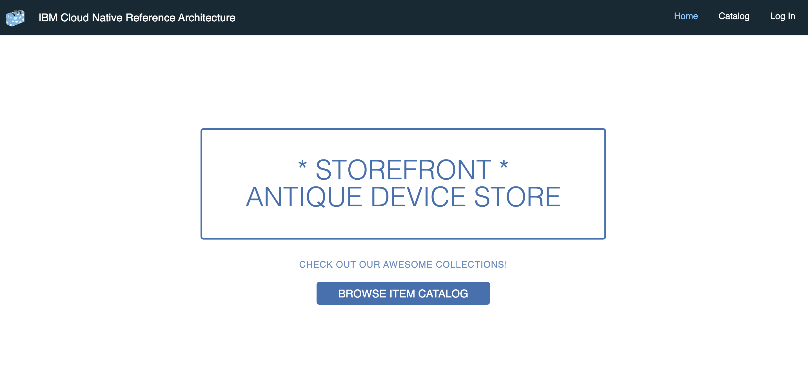

## Introduction

Storefront is a simple shopping application that displays a catalog of antique computing devices, where users can search and buy products. It has a Web interface, and it relies on BFF (Backend for Frontend) services to interact with the backend services.

## Pre-requisites:

* [Appsody](https://appsody.dev/)
  - [Installing on MacOS](https://appsody.dev/docs/installing/macos)
  - [Installing on Windows](https://appsody.dev/docs/installing/windows)
  - [Installing on RHEL](https://appsody.dev/docs/installing/rhel)
  - [Installing on Ubuntu](https://appsody.dev/docs/installing/ubuntu)

For more details on installation, check [this](https://appsody.dev/docs/installing/installing-appsody/) out.

* Docker Desktop
  - [Docker for Mac](https://docs.docker.com/docker-for-mac/)
  - [Docker for Windows](https://docs.docker.com/docker-for-windows/)

## Running the application locally

Let us now deploy all the microservices of our storefront one by one locally.

### Inventory

- Clone inventory repository

```bash
git clone https://github.com/ibm-garage-ref-storefront/inventory-ms-spring.git
cd inventory-ms-spring
```

#### Deploy MySQL database

<br></br>

```
# Start a MySQL Container with a database user, a password, and create a new database
docker run --name inventorymysql \
    -e MYSQL_ROOT_PASSWORD=admin123 \
    -e MYSQL_USER=dbuser \
    -e MYSQL_PASSWORD=password \
    -e MYSQL_DATABASE=inventorydb \
    -p 3306:3306 \
    -d mysql:5.7.14
```

If it is successfully deployed, you will see something like below.

```
$ docker ps
CONTAINER ID        IMAGE               COMMAND                  CREATED             STATUS              PORTS                    NAMES
84a511e74794        mysql:5.7.14        "docker-entrypoint.s…"   13 seconds ago      Up 12 seconds       0.0.0.0:3306->3306/tcp   inventorymysql
```

- Now let us populate the MySQL with data.

Firstly, `ssh` into the MySQL container.

```
docker exec -it inventorymysql bash
```

- Now, run the below command for table creation.

```
mysql -udbuser -ppassword
```

- This will take you to something like below.

```
root@d88a6e5973de:/# mysql -udbuser -ppassword
mysql: [Warning] Using a password on the command line interface can be insecure.
Welcome to the MySQL monitor.  Commands end with ; or \g.
Your MySQL connection id is 2
Server version: 5.7.14 MySQL Community Server (GPL)

Copyright (c) 2000, 2016, Oracle and/or its affiliates. All rights reserved.

Oracle is a registered trademark of Oracle Corporation and/or its
affiliates. Other names may be trademarks of their respective
owners.

Type 'help;' or '\h' for help. Type '\c' to clear the current input statement.

mysql>
```

- Go to `scripts > mysql_data.sql`. Copy the contents from [mysql_data.sql](https://github.com/ibm-garage-ref-storefront/inventory-ms-spring/blob/master/scripts/mysql_data.sql) and paste the contents in the console.

- You can exit from the console using `exit`.

```
mysql> exit
Bye
```

- To come out of the container, enter `exit`.

```
root@d88a6e5973de:/# exit
```

#### Deploy Inventory app

<br></br>

Run the below command.

```
# Build inventory docker image
appsody build

# Start the Inventory Container
docker run --name inventory-ms-spring \
    -e MYSQL_HOST=<docker_host> \
    -e MYSQL_PORT=3306 \
    -e MYSQL_USER=dbuser \
    -e MYSQL_PASSWORD=password \
    -e MYSQL_DATABASE=inventorydb \
    -p 8081:8080 \
    -d dev.local/inventory-ms-spring
```

For instance, if it is docker-for-mac `<docker_host>` will be `docker.for.mac.localhost`.

- You can also verify it as follows.

```
$ docker ps
CONTAINER ID        IMAGE                           COMMAND                  CREATED             STATUS              PORTS                              NAMES
aad8b8e1bce6        dev.local/inventory-ms-spring   "/start.sh"              6 seconds ago       Up 5 seconds        8443/tcp, 0.0.0.0:8081->8080/tcp   inventory-ms-spring
7a958fa9cae3        mysql:5.7.14                    "docker-entrypoint.s…"   50 minutes ago      Up 50 minutes       0.0.0.0:3306->3306/tcp             inventorymysql
```

### Catalog

- Clone catalog repository

```bash
git clone https://github.com/ibm-garage-ref-storefront/catalog-ms-spring.git
cd catalog-ms-spring
```

#### Deploy ElasticSearch

<br></br>

```
# Start an Elasticsearch Container
docker run --name catalogelasticsearch \
      -e "discovery.type=single-node" \
      -p 9200:9200 \
      -p 9300:9300 \
      -d docker.elastic.co/elasticsearch/elasticsearch:6.3.2
```

If it is successfully deployed, you will see something like below.

```
$ docker ps
CONTAINER ID        IMAGE                                                 COMMAND                  CREATED             STATUS              PORTS                                            NAMES
cc5af0ec4f75        docker.elastic.co/elasticsearch/elasticsearch:6.3.2   "/usr/local/bin/dock…"   6 minutes ago       Up 6 minutes        0.0.0.0:9200->9200/tcp, 0.0.0.0:9300->9300/tcp   catalogelasticsearch
aad8b8e1bce6        dev.local/inventory-ms-spring                         "/start.sh"              11 minutes ago      Up 11 minutes       8443/tcp, 0.0.0.0:8081->8080/tcp                 inventory-ms-spring
7a958fa9cae3        mysql:5.7.14                                          "docker-entrypoint.s…"   About an hour ago   Up About an hour    0.0.0.0:3306->3306/tcp                           inventorymysql
```

#### Deploy Catalog app

<br></br>

Run the below command.

```
# Build catalog docker image
appsody build

# Start the Catalog Container
docker run --name catalog-ms-spring \
    -e ELASTIC_CLUSTER_NAME=docker-cluster \
    -e ELASTIC_NODE_URL=<docker_host>:9300 \
    -e INVENTORY_URL=http://<docker_host>:8081/micro/inventory \
    -p 8082:8080 \
    -d dev.local/catalog-ms-spring
```

For instance, if it is docker-for-mac `<docker_host>` will be `docker.for.mac.localhost`.

- You can also verify it as follows.

```
docker ps
CONTAINER ID        IMAGE                                                 COMMAND                  CREATED             STATUS              PORTS                                            NAMES
4d9b74402abb        dev.local/catalog-ms-spring                           "/start.sh"              4 seconds ago       Up 3 seconds        8443/tcp, 0.0.0.0:8082->8080/tcp                 catalog-ms-spring
cc5af0ec4f75        docker.elastic.co/elasticsearch/elasticsearch:6.3.2   "/usr/local/bin/dock…"   37 minutes ago      Up 37 minutes       0.0.0.0:9200->9200/tcp, 0.0.0.0:9300->9300/tcp   catalogelasticsearch
aad8b8e1bce6        dev.local/inventory-ms-spring                         "/start.sh"              41 minutes ago      Up 41 minutes       8443/tcp, 0.0.0.0:8081->8080/tcp                 inventory-ms-spring
7a958fa9cae3        mysql:5.7.14                                          "docker-entrypoint.s…"   2 hours ago         Up 2 hours          0.0.0.0:3306->3306/tcp                           inventorymysql
```

### Customer

- Clone customer repository

```bash
git clone https://github.com/ibm-garage-ref-storefront/customer-ms-spring
cd customer-ms-spring
```

#### Deploy CouchDB

<br></br>

```
# Start a CouchDB Container with a database user, a password, and create a new database
docker run --name customercouchdb -p 5985:5984 -e COUCHDB_USER=admin -e COUCHDB_PASSWORD=passw0rd -d couchdb:2.1.2
```

If it is successfully deployed, you will see something like below.

```
$ docker ps
CONTAINER ID        IMAGE                                                 COMMAND                  CREATED             STATUS              PORTS                                            NAMES
3be611140a1a        couchdb:2.1.2                                         "tini -- /docker-ent…"   26 seconds ago      Up 23 seconds       4369/tcp, 9100/tcp, 0.0.0.0:5985->5984/tcp       customercouchdb
4d9b74402abb        dev.local/catalog-ms-spring                           "/start.sh"              14 hours ago        Up 14 hours         8443/tcp, 0.0.0.0:8082->8080/tcp                 catalog-ms-spring
cc5af0ec4f75        docker.elastic.co/elasticsearch/elasticsearch:6.3.2   "/usr/local/bin/dock…"   15 hours ago        Up 15 hours         0.0.0.0:9200->9200/tcp, 0.0.0.0:9300->9300/tcp   catalogelasticsearch
aad8b8e1bce6        dev.local/inventory-ms-spring                         "/start.sh"              15 hours ago        Up 15 hours         8443/tcp, 0.0.0.0:8081->8080/tcp                 inventory-ms-spring
7a958fa9cae3        mysql:5.7.14                                          "docker-entrypoint.s…"   16 hours ago        Up 16 hours         0.0.0.0:3306->3306/tcp                           inventorymysql
```

#### Deploy Customer app

<br></br>

Run the below command.

```
# Build customer docker image
appsody build

# Start the customer Container
docker run --name customer-ms-spring \
    -e COUCHDB_PORT=5985 \
    -e COUCHDB_HOST=<docker_host> \
    -e COUCHDB_PROTOCOL=http \
    -e COUCHDB_USERNAME=admin \
    -e COUCHDB_PASSWORD=passw0rd \
    -e COUCHDB_DATABASE=customers \
    -e HS256_KEY=E6526VJkKYhyTFRFMC0pTECpHcZ7TGcq8pKsVVgz9KtESVpheEO284qKzfzg8HpWNBPeHOxNGlyudUHi6i8tFQJXC8PiI48RUpMh23vPDLGD35pCM0417gf58z5xlmRNii56fwRCmIhhV7hDsm3KO2jRv4EBVz7HrYbzFeqI45CaStkMYNipzSm2duuer7zRdMjEKIdqsby0JfpQpykHmC5L6hxkX0BT7XWqztTr6xHCwqst26O0g8r7bXSYjp4a \
    -p 8083:8080 \
    -d dev.local/customer-ms-spring
```

For instance, if it is docker-for-mac `<docker_host>` will be `docker.for.mac.localhost`.

- You can also verify it as follows.

```
$ docker ps
CONTAINER ID        IMAGE                                                 COMMAND                  CREATED             STATUS              PORTS                                            NAMES
34f3b55f7bee        dev.local/customer-ms-spring                          "/start.sh"              59 seconds ago      Up 58 seconds       8443/tcp, 0.0.0.0:8083->8080/tcp                 customer-ms-spring
3be611140a1a        couchdb:2.1.2                                         "tini -- /docker-ent…"   26 minutes ago      Up 26 minutes       4369/tcp, 9100/tcp, 0.0.0.0:5985->5984/tcp       customercouchdb
4d9b74402abb        dev.local/catalog-ms-spring                           "/start.sh"              15 hours ago        Up 15 hours         8443/tcp, 0.0.0.0:8082->8080/tcp                 catalog-ms-spring
cc5af0ec4f75        docker.elastic.co/elasticsearch/elasticsearch:6.3.2   "/usr/local/bin/dock…"   15 hours ago        Up 15 hours         0.0.0.0:9200->9200/tcp, 0.0.0.0:9300->9300/tcp   catalogelasticsearch
aad8b8e1bce6        dev.local/inventory-ms-spring                         "/start.sh"              15 hours ago        Up 15 hours         8443/tcp, 0.0.0.0:8081->8080/tcp                 inventory-ms-spring
7a958fa9cae3        mysql:5.7.14                                          "docker-entrypoint.s…"   16 hours ago        Up 16 hours         0.0.0.0:3306->3306/tcp                           inventorymysql
```

### Auth

- Clone auth repository

```bash
git clone https://github.com/ibm-garage-ref-storefront/auth-ms-spring.git
cd auth-ms-spring
```

#### Deploy Auth app

<br></br>

Run the below command.

```
# Build auth docker image
appsody build

# Start the Auth Container
docker run --name auth-ms-spring \
    -e CUSTOMER_URL=http://<docker_host>:8083/micro/customer/search \
    -e HS256_KEY=E6526VJkKYhyTFRFMC0pTECpHcZ7TGcq8pKsVVgz9KtESVpheEO284qKzfzg8HpWNBPeHOxNGlyudUHi6i8tFQJXC8PiI48RUpMh23vPDLGD35pCM0417gf58z5xlmRNii56fwRCmIhhV7hDsm3KO2jRv4EBVz7HrYbzFeqI45CaStkMYNipzSm2duuer7zRdMjEKIdqsby0JfpQpykHmC5L6hxkX0BT7XWqztTr6xHCwqst26O0g8r7bXSYjp4a \
    -p 8084:8080 \
    -d dev.local/auth-ms-spring
```

For instance, if it is docker-for-mac `<docker_host>` will be `docker.for.mac.localhost`.

- You can also verify it as follows.

```
$ docker ps
CONTAINER ID        IMAGE                                                 COMMAND                  CREATED             STATUS              PORTS                                            NAMES
a4a2aa7d9c59        dev.local/auth-ms-spring                              "/start.sh"              24 seconds ago      Up 23 seconds       8443/tcp, 0.0.0.0:8084->8080/tcp                 auth-ms-spring
3be611140a1a        couchdb:2.1.2                                         "tini -- /docker-ent…"   26 minutes ago      Up 26 minutes       4369/tcp, 9100/tcp, 0.0.0.0:5985->5984/tcp       customercouchdb
4d9b74402abb        dev.local/catalog-ms-spring                           "/start.sh"              15 hours ago        Up 15 hours         8443/tcp, 0.0.0.0:8082->8080/tcp                 catalog-ms-spring
cc5af0ec4f75        docker.elastic.co/elasticsearch/elasticsearch:6.3.2   "/usr/local/bin/dock…"   15 hours ago        Up 15 hours         0.0.0.0:9200->9200/tcp, 0.0.0.0:9300->9300/tcp   catalogelasticsearch
aad8b8e1bce6        dev.local/inventory-ms-spring                         "/start.sh"              15 hours ago        Up 15 hours         8443/tcp, 0.0.0.0:8081->8080/tcp                 inventory-ms-spring
7a958fa9cae3        mysql:5.7.14                                          "docker-entrypoint.s…"   16 hours ago        Up 16 hours         0.0.0.0:3306->3306/tcp                           inventorymysql
```

### Orders

- Clone orders repository

```bash
git clone https://github.com/ibm-garage-ref-storefront/orders-ms-spring.git
cd orders-ms-spring
```

#### Deploy Mariadb

<br></br>

```
# Start a MariaDB Container with a database user, a password, and create a new database
docker run --name ordersmysql \
    -e MYSQL_ROOT_PASSWORD=admin123 \
    -e MYSQL_USER=dbuser \
    -e MYSQL_PASSWORD=password \
    -e MYSQL_DATABASE=ordersdb \
    -p 3307:3306 \
    -d mariadb
```

If it is successfully deployed, you will see something like below.

```
$ docker ps
CONTAINER ID        IMAGE                                                 COMMAND                  CREATED             STATUS              PORTS                                            NAMES
a0b8b6357607        mariadb                                               "docker-entrypoint.s…"   7 seconds ago       Up 4 seconds        0.0.0.0:3307->3306/tcp                           ordersmysql
a4a2aa7d9c59        dev.local/auth-ms-spring                              "/start.sh"              3 minutes ago       Up 3 minutes        8443/tcp, 0.0.0.0:8084->8080/tcp                 auth-ms-spring
3be611140a1a        couchdb:2.1.2                                         "tini -- /docker-ent…"   29 minutes ago      Up 29 minutes       4369/tcp, 9100/tcp, 0.0.0.0:5985->5984/tcp       customercouchdb
4d9b74402abb        dev.local/catalog-ms-spring                           "/start.sh"              15 hours ago        Up 15 hours         8443/tcp, 0.0.0.0:8082->8080/tcp                 catalog-ms-spring
cc5af0ec4f75        docker.elastic.co/elasticsearch/elasticsearch:6.3.2   "/usr/local/bin/dock…"   15 hours ago        Up 15 hours         0.0.0.0:9200->9200/tcp, 0.0.0.0:9300->9300/tcp   catalogelasticsearch
aad8b8e1bce6        dev.local/inventory-ms-spring                         "/start.sh"              16 hours ago        Up 16 hours         8443/tcp, 0.0.0.0:8081->8080/tcp                 inventory-ms-spring
7a958fa9cae3        mysql:5.7.14                                          "docker-entrypoint.s…"   16 hours ago        Up 16 hours         0.0.0.0:3306->3306/tcp                           inventorymysql
```

#### Deploy Orders app

<br></br>

Run the below command.

```
# Build orders docker image
appsody build

# Start the Orders Container
docker run --name orders-ms-spring \
    -e MYSQL_HOST=<docker_host> \
    -e MYSQL_PORT=3307 \
    -e MYSQL_DATABASE=ordersdb \
    -e MYSQL_USER=dbuser \
    -e MYSQL_PASSWORD=password \
    -e HS256_KEY=E6526VJkKYhyTFRFMC0pTECpHcZ7TGcq8pKsVVgz9KtESVpheEO284qKzfzg8HpWNBPeHOxNGlyudUHi6i8tFQJXC8PiI48RUpMh23vPDLGD35pCM0417gf58z5xlmRNii56fwRCmIhhV7hDsm3KO2jRv4EBVz7HrYbzFeqI45CaStkMYNipzSm2duuer7zRdMjEKIdqsby0JfpQpykHmC5L6hxkX0BT7XWqztTr6xHCwqst26O0g8r7bXSYjp4a \
    -p 8085:8080 \
    -d dev.local/orders-ms-spring
```

For instance, if it is docker-for-mac `<docker_host>` will be `docker.for.mac.localhost`.

- You can also verify it as follows.

```
$ docker ps
CONTAINER ID        IMAGE                                                 COMMAND                  CREATED             STATUS              PORTS                                            NAMES
f21a9ac266c5        dev.local/orders-ms-spring                            "/start.sh"              50 seconds ago      Up 49 seconds       8443/tcp, 0.0.0.0:8085->8080/tcp                 orders-ms-spring
a0b8b6357607        mariadb                                               "docker-entrypoint.s…"   15 minutes ago      Up 14 minutes       0.0.0.0:3307->3306/tcp                           ordersmysql
a4a2aa7d9c59        dev.local/auth-ms-spring                              "/start.sh"              18 minutes ago      Up 18 minutes       8443/tcp, 0.0.0.0:8084->8080/tcp                 auth-ms-spring
3be611140a1a        couchdb:2.1.2                                         "tini -- /docker-ent…"   44 minutes ago      Up 44 minutes       4369/tcp, 9100/tcp, 0.0.0.0:5985->5984/tcp       customercouchdb
4d9b74402abb        dev.local/catalog-ms-spring                           "/start.sh"              15 hours ago        Up 15 hours         8443/tcp, 0.0.0.0:8082->8080/tcp                 catalog-ms-spring
cc5af0ec4f75        docker.elastic.co/elasticsearch/elasticsearch:6.3.2   "/usr/local/bin/dock…"   16 hours ago        Up 16 hours         0.0.0.0:9200->9200/tcp, 0.0.0.0:9300->9300/tcp   catalogelasticsearch
aad8b8e1bce6        dev.local/inventory-ms-spring                         "/start.sh"              16 hours ago        Up 16 hours         8443/tcp, 0.0.0.0:8081->8080/tcp                 inventory-ms-spring
7a958fa9cae3        mysql:5.7.14                                          "docker-entrypoint.s…"   17 hours ago        Up 17 hours         0.0.0.0:3306->3306/tcp                           inventorymysql
```

### Storefront UI

- Clone auth repository

```bash
git clone https://github.com/ibm-garage-ref-storefront/storefront-ui.git
cd storefront-ui
```

#### Deploy Storefront UI

<br></br>

Run the below command.

```
# Build storefront ui docker image
appsody build

# Start the Storefront UI Container
docker run --name web \
  -e NODE_ENV=development \
  -p 3000:3000 \
  -d dev.local/web
```

For instance, if it is docker-for-mac `<docker_host>` will be `docker.for.mac.localhost`.

- You can also verify it as follows.

```
$ docker ps
CONTAINER ID        IMAGE                                                 COMMAND                  CREATED              STATUS              PORTS                                            NAMES
c0d657aa0886        dev.local/orders-ms-spring                            "/start.sh"              About a minute ago   Up About a minute   8443/tcp, 0.0.0.0:8085->8080/tcp                 orders-ms-spring
093f8059c245        dev.local/web                                         "container-entrypoin…"   8 minutes ago        Up 8 minutes        0.0.0.0:3000->3000/tcp, 8080/tcp                 web
a0b8b6357607        mariadb                                               "docker-entrypoint.s…"   2 hours ago          Up 2 hours          0.0.0.0:3307->3306/tcp                           ordersmysql
a4a2aa7d9c59        dev.local/auth-ms-spring                              "/start.sh"              2 hours ago          Up 2 hours          8443/tcp, 0.0.0.0:8084->8080/tcp                 auth-ms-spring
3be611140a1a        couchdb:2.1.2                                         "tini -- /docker-ent…"   2 hours ago          Up 2 hours          4369/tcp, 9100/tcp, 0.0.0.0:5985->5984/tcp       customercouchdb
4d9b74402abb        dev.local/catalog-ms-spring                           "/start.sh"              16 hours ago         Up 16 hours         8443/tcp, 0.0.0.0:8082->8080/tcp                 catalog-ms-spring
cc5af0ec4f75        docker.elastic.co/elasticsearch/elasticsearch:6.3.2   "/usr/local/bin/dock…"   17 hours ago         Up 17 hours         0.0.0.0:9200->9200/tcp, 0.0.0.0:9300->9300/tcp   catalogelasticsearch
aad8b8e1bce6        dev.local/inventory-ms-spring                         "/start.sh"              17 hours ago         Up 17 hours         8443/tcp, 0.0.0.0:8081->8080/tcp                 inventory-ms-spring
7a958fa9cae3        mysql:5.7.14                                          "docker-entrypoint.s…"   18 hours ago         Up 18 hours         0.0.0.0:3306->3306/tcp                           inventorymysql
```

There you go, you deploy all the necessary services for storefront.

Now, let us check the app out. You can access it at http://localhost:3000.


