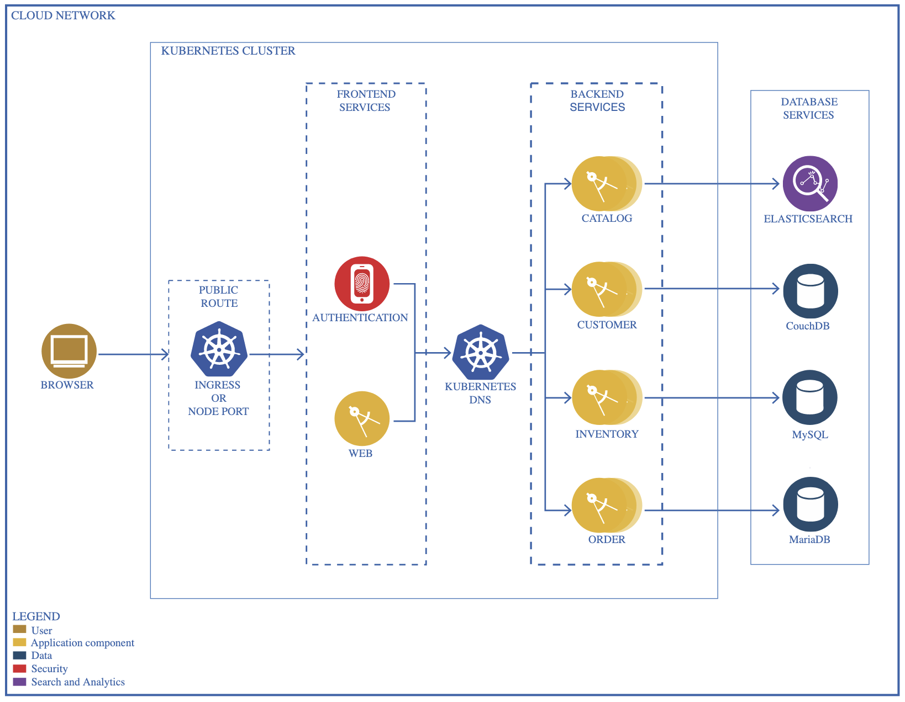
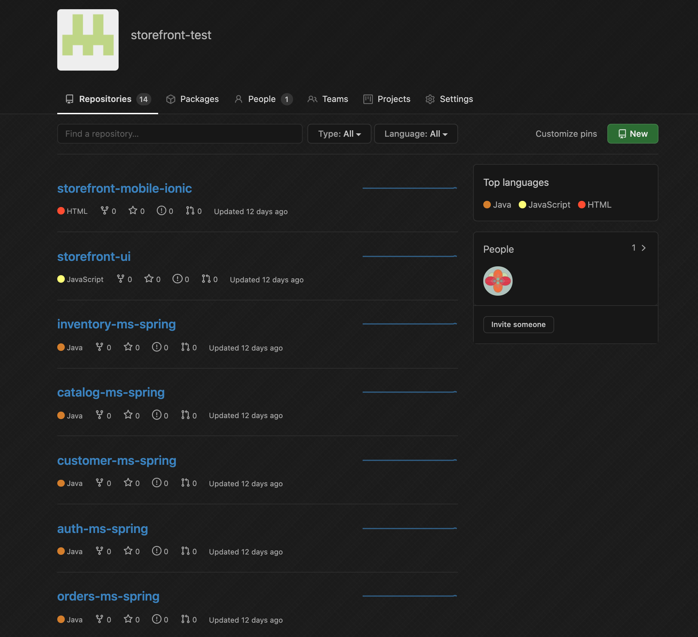
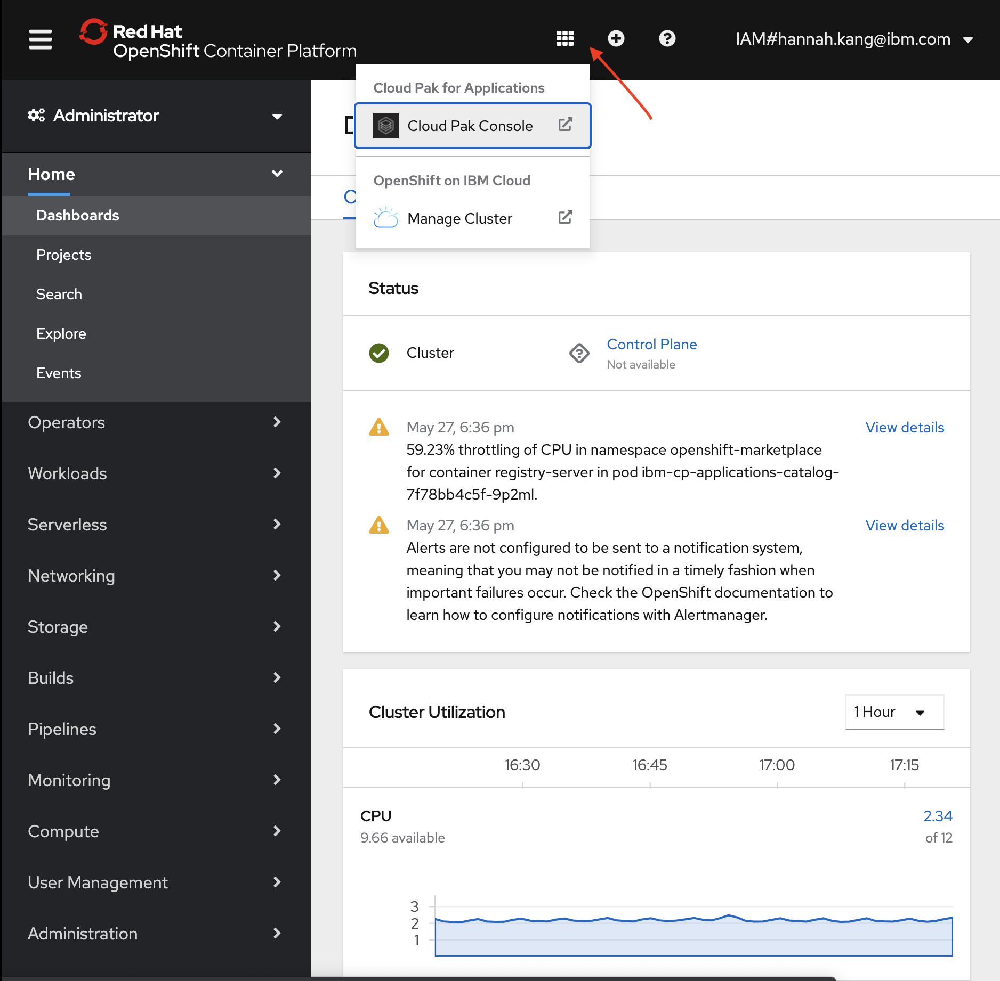
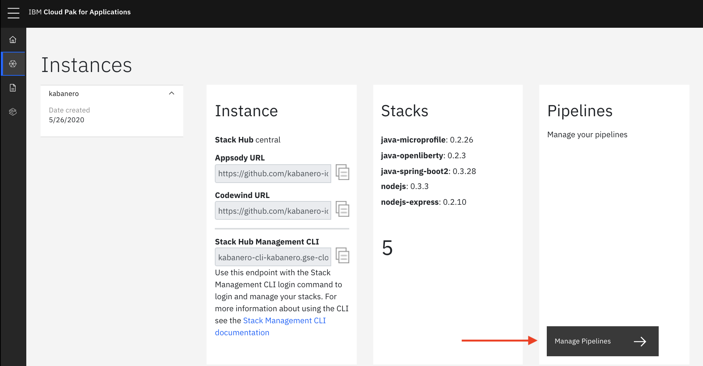
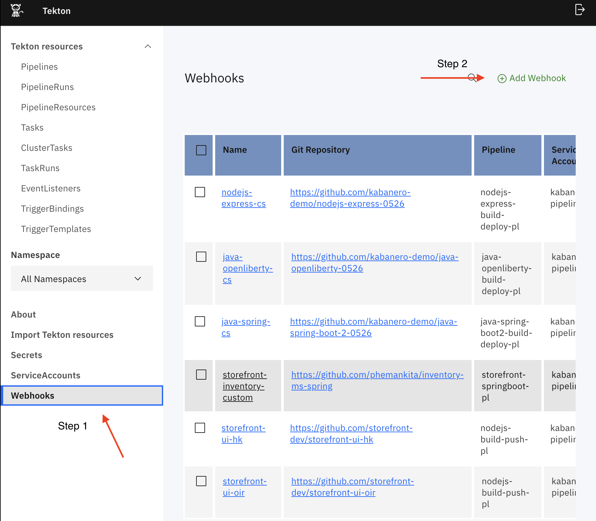
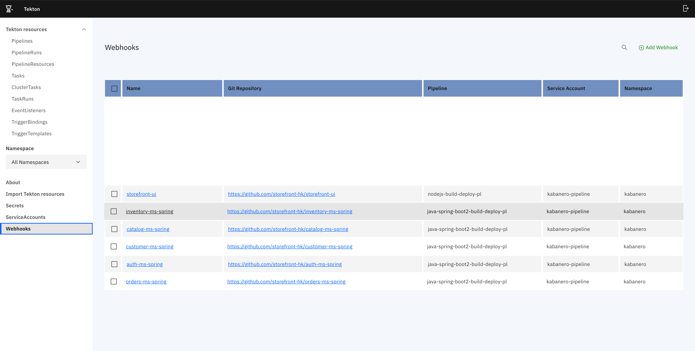
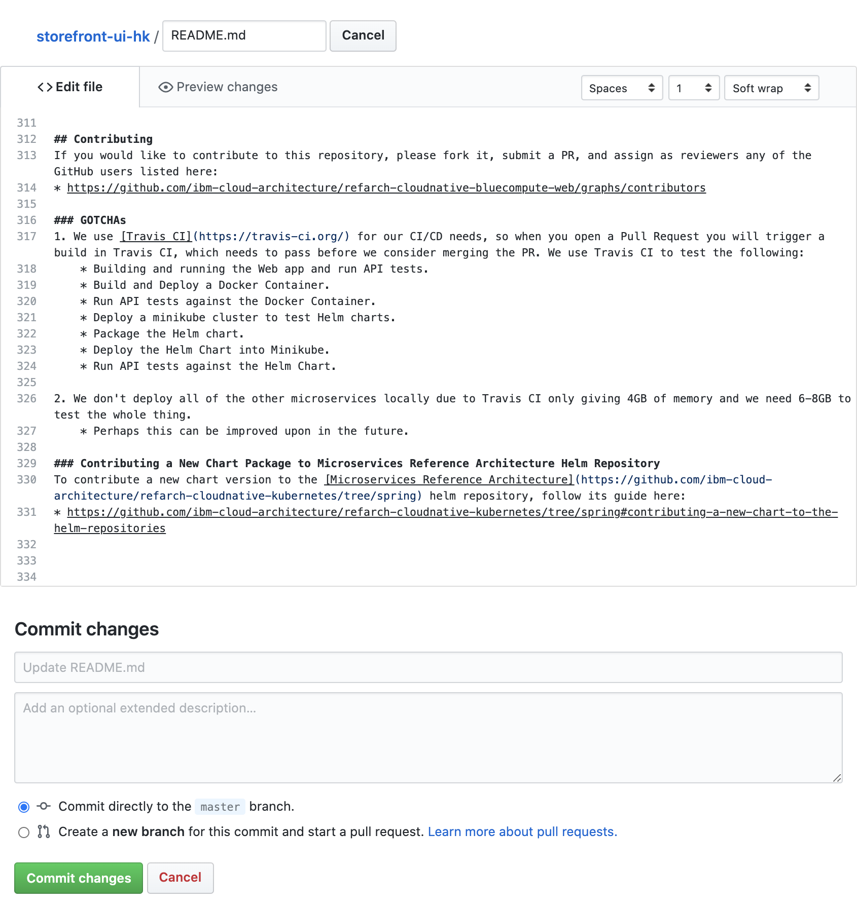
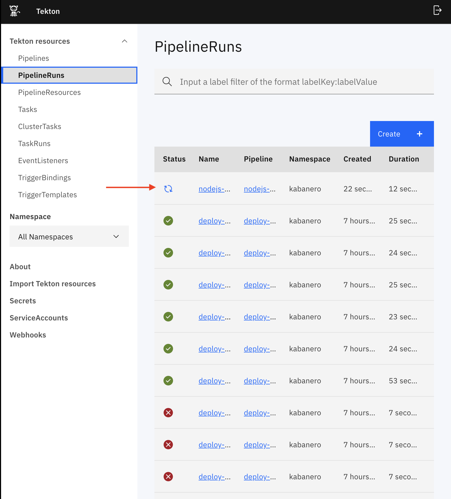
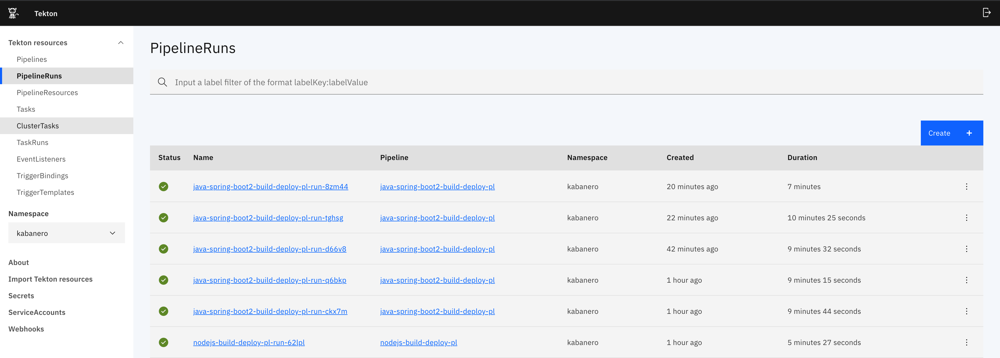
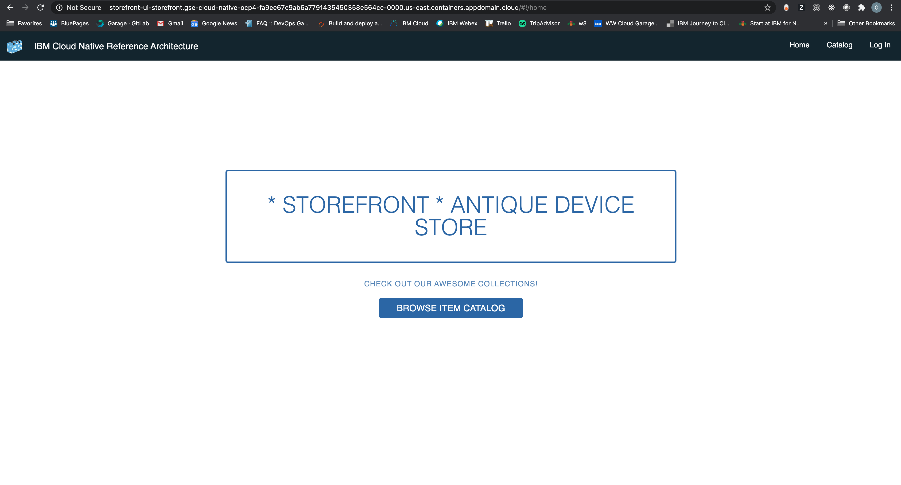

## Introduction
Today you will be learning how to deploy all storefront microservices on Openshift using Tekton



## Table of Contents
  * [Pre-requisites](#pre-requisites)
  * [Set Up Databases for Storefront](#set-up-databases-for-storefront)
  * [Create an organization on Github](#create-an-organization-on-github)
  * [Deploy Microservices to Openshift](#deploy-microservices-to-openshift)
  * [Trigger the Webhook](#trigger-the-webhook)
  * [Build & Run Storefront Mobile App](#build-and-run-storefront-mobile-app)

## Pre-requisites 

+ [`Openshift`](https://docs.openshift.com/container-platform/4.3/welcome/index.html)
+ [`Kabanero`](https://kabanero.io/)
+ [`CloudPak for Apps`](https://www.ibm.com/cloud/cloud-pak-for-applications)
+ [`Docker cli`](https://docs.docker.com/docker-for-mac/install/)
+ [`Git cli`](https://git-scm.com/downloads)
+ [`OC cli`](https://docs.openshift.com/container-platform/4.3/welcome/index.html)
+ [`Tekton cli`](https://github.com/tektoncd/cli)
+ [`gh cli`](https://cli.github.com/)
+ [appsody](https://appsody.dev/docs/getting-started/installation)
+ [IBM Mobile Foundation CLI](https://www.npmjs.com/package/mfpdev-cli)
+ [Ionic CLI Version 5.4.16](https://ionicframework.com/docs/cli)

## Set Up Databases for Storefront

This project will demonstrate how to deploy all the databases that are required by the storefront application. This will show you how to deploy MySQL, Elasticsearch, CouchDB, and MariaDB databases.

### Clone the repo

```bash
git clone https://github.com/ibm-garage-ref-storefront/storefront-databases.git
cd storefront-databases
chmod +x ./setup_databases.sh
```

Run the below command to deploy the databases on the openshift cluster where `storefront-dev` is the project name.

```bash
oc login --token={your-api-token} --server={your-servername}
./setup_databases.sh storefront-dev
```

The output should be something similar to what is shown below.
```bash
> ./setup_databases.sh storefront-dev
NAMESPACE not set. Using parameter "storefront-dev"
=========================================================================
Set namespace
error: A project named "storefront-dev" does not exist on "https://c100-e.us-east.containers.cloud.ibm.com:30077".
Your projects are:
* calico-system
* catapp
* csantana-cf2k8s-test1
.
.
.
* ta
* tekton-pipelines
* tigera-operator
To see projects on another server, pass '--server=<server>'.
Now using project "storefront-dev" on server "https://c100-e.us-east.containers.cloud.ibm.com:30077".

You can add applications to this project with the 'new-app' command. For example, try:

    oc new-app centos/ruby-25-centos7~https://github.com/sclorg/ruby-ex.git

to build a new example application in Ruby.
=========================================================================
Adding security constraints
scc "anyuid" added to: ["system:serviceaccount:storefront-dev:default"]
scc "privileged" added to: ["system:serviceaccount:storefront-dev:default"]
=========================================================================
Generating necessary secrets
secret/customer-couchdb-couchdb created
secret/orders-mariadb-secret created
secret/inventory-mysql created
=========================================================================
Generating necessary configmaps
configmap/customer-couchdb-couchdb created
configmap/mariadb-configmap created
configmap/orders-mariadb-tests created
configmap/inventory-mysql-test created
=========================================================================
Deploying the databases
statefulset.apps/customer-couchdb-couchdb created
deployment.apps/elasticsearch created
statefulset.apps/orders-mariadb created
deployment.extensions/inventory-mysql created
Waiting for deployment "inventory-mysql" rollout to finish: 0 of 1 updated replicas are available...
deployment "inventory-mysql" successfully rolled out
deployment "elasticsearch" successfully rolled out
Waiting for 1 pods to be ready...
partitioned roll out complete: 1 new pods have been updated...
Waiting for 1 pods to be ready...
statefulset rolling update complete 1 pods at revision orders-mariadb-77b894447...
=========================================================================
Creating database services
service/customer-couchdb-couchdb created
service/customer-couchdb-svc-couchdb created
service/elasticsearch created
service/orders-mariadb created
service/inventory-mysql created
=========================================================================
Populating data in database
configmap/inventory-ms-spring-data created
job.batch/inventory-ms-spring-populate-mysql created
job.batch/customer-ms-spring-create-user created
job.batch/inventory-ms-spring-populate-mysql condition met
job.batch/customer-ms-spring-create-user condition met
=========================================================================
```

Now access your new project 
```
oc project storefront-dev
```
You should get an output similar to what is shown below

```bash
> oc project storefront-dev
> oc get pods
  NAME                                       READY     STATUS      RESTARTS   AGE
  customer-couchdb-couchdb-0                 2/2       Running     0          5m55s
  customer-ms-spring-create-user-v26cw       0/1       Completed   0          5m1s
  elasticsearch-7b49df8497-p87fd             1/1       Running     0          5m55s
  inventory-ms-spring-populate-mysql-dz8n4   0/1       Completed   0          5m2s
  inventory-mysql-8667979689-mcgkb           1/1       Running     0          5m54s
  orders-mariadb-0                           1/1       Running     0          5m55s
```
Upon completing this section you can see above all of your databases have been deployed onto your openshift cluster.

## Create an organization on Github

When you create a new organization from scratch, it doesn't have any repositories associated with it.

Github has information on how to create an organization. View the link below for the steps:

https://help.github.com/en/github/setting-up-and-managing-organizations-and-teams/creating-a-new-organization-from-scratch

## Clone the storefront-repo-automator to run the script 

You can manually create a new repo and added it onto your Github organization or you can use the script that we provided for you. Clone the repository [storefront-repo-automator](https://github.com/ibm-garage-ref-storefront/storefront-repo-automator) as shown below:

Once you have cloned the repository, make sure you run the following command: 


  ``` bash
  git clone https://github.com/ibm-garage-ref-storefront/storefront-repo-automator
  cd storefront-repo-automator
  export org={your-github-org-you-created}
  ./run.sh
  ```

After running the storefront-repo-automator, you should be able to see the storefront repositories as shown below.



## Deploy Microservices to Openshift

Today you will learning how to deploy all microservices to Openshift by creating a Webhook on Tekton. To achieve this, you must run the following steps:

- Go on [cloud.ibm.com](cloud.ibm.com)

- On the resource list, you should see a list of your clusters.

- Once you have the cluster you want to work on, click on the Openshift web console. When you are on the Openshift web console, click on the box icon and go into Cloud Pak console. 

**See image below for reference**

 

Once you are inside the IBM Cloud Pak console, click on the second icon to access the * **Instances** * page. On the page inside the Pipeline box, click on the button * **Manage Pipelines** *



Go to your Tekton Dashboard and click `Webhooks` as shown in Step 1. After you click on `Webhooks` you should be able to `Add Webhook` as shown in step 2.



## Trigger the Webhook

To trigger your Webhook, you must run the following steps for each microservice:

- customer
- orders
- inventory
- catalog
- auth
- storefront-ui

Create a webhook for each microservice as shown below: 

For the java applications (customer, orders, inventory, catalog, auth) use the `java-springboot2-build-deploy-pl` 
and for the applications (storefront-ui) use `nodejs-build-deploy-pl` as the pipeline.


Your webhooks page should look something similar as shown below:



Make a small change to trigger the pipeline such as editing the README.md file and commit to trigger a change for all microservices.



Once you make your changes onto your repositories you should see something as shown below: 



Once all of your pipelines complete as shown below you can run the following command to get your url.



```bash
> oc project storefront-dev
> oc get routes | grep "web"
web  web-storefront-dev-hk.gse-cloud-native-ocp4-fa9ee67c9ab6a7791435450358e564cc-0000.us-east.containers.appdomain.cloud web 3000-tcp  None
```
Now go to your browser and type in 
`web-storefront-dev-hk.gse-cloud-native-ocp4-fa9ee67c9ab6a7791435450358e564cc-0000.us-east.containers.appdomain.cloud web`


## Result 


## Build and Run Storefront Mobile App
The storefront mobile app uses IBM Mobile Foundation services as the Mobile BFF to provide mobile security, secure connectivity to backend services, push notifications etc.

### Installing IBM Mobile Foundation Services on Redhat OpenShift
There are multiple options to obtaining IBM Mobile Foundation and installing on a OCP cluster:-
  - IBM CloudPak for Apps (CP4A) bundles IBM Mobile Foundation.  To install IBM Mobile Foundation from CP4A see [here](https://www.ibm.com/support/knowledgecenter/en/SSCSJL_4.1.x/install-mf-cli.html)
  - To use an existing license of IBM Mobile Foundation and deploy to OpenShift see [here](https://mobilefirstplatform.ibmcloud.com/tutorials/en/foundation/8.0/ibmcloud/mobilefoundation-on-openshift/)
  - For trial and development purposes you use the Community Edition of IBM Mobile Foundation for free with the constraint that you may run only a single pod and all service data is persisted in-memory upto the lifetime of the pod.

  To help you quickly get a feel of IBM Mobile Foundation integration in the Storefront application we will take you through the installation of the Community Edition.
 
### Setup & run the Storefront Mobile App
  - Clone the storefront mobile repo
    ``` bash
    > git clone git@github.com:ibm-garage-ref-storefront/storefront-mobile.git
    > cd storefront-mobile
    ```
  - Deploy IBM Mobile Foundation Community Edition
    ```bash
    > oc project storefront-dev
    > oc apply --recursive --filename mobilefoundation
    > oc expose svc storefront-mf
    ```
  - Edit `mfpconfig/app_config.json` file and update the json object for the key `adapters` with the endpoint url of storefront auth service, clientId and secret
  - Edit `mfpconfig/app_config.json` file and update the json object for the key `backendservices` with the appropriate endpoint urls of the storefront backend services
  - To enable Mobile Foundation Push Notifications service for this application you must configure the service for Push Notification Credentials (FCM, APNS).  Edit `mfpconfig/app_config.json` file and update it for these credentials under json object `services.push.settings`.  To know more about what these settings and credentials are about lookup https://mobilefirstplatform.ibmcloud.com/tutorials/en/foundation/8.0/notifications/sending-notifications/#setting-up-notifications    
  - To enable push notification on Android remember to replace `google-services.json` into the directory `ionic` 
  - Edit mfpconfig/server_config.json and input the endpoint url (route), port and admin credentials for the Mobile Foundation Server

    All other required configurations are already preset into `mfpconfig/app_config.json` file.  Save `mfpconfig/app_config.json` and `mfpconfig/server_config.json`
  - Use the IBM Mobile Foundation CLI and execute the following command to configure the IBM Mobile Foundation services for the storefront app.
    ```bash
    > mfpdev app register
    ```
    You must observer the following output...
    ```
    Verifying server configuration...
    Registering to server:'http://<mobile foundation endpoint url>:<port>' runtime:'mfp'
    Registered app for platform: android
    Registered app for platform: ios
    ```
    Now the IBM Mobile Foundation (the mobile BFF) is deployed, configured and running proceed further to build and run the storefront mobile application.
  - Edit `ionic/config.xml` file and update the element `<mfp:server runtime="mfp" url="<openshift route of mobile foundation>" />` for the url endpoint of the Mobile Foundation server
  - From a command-line window, navigate to the project's root folder and run the commands:
    - `cd ionic` - to navigate to application folder
    - `ionic cordova platform add ios` or `ionic cordova platform add android` - to add a platform.
    - `npm install` - to install all required modules.
    - `ionic cordova run` - to run the application.

  - Run the application to view the catalog, make an order and review the user profile.  NOTE: When you place an order you will receive a push notification on your mobile app regardign the shipment of your order.

     


  