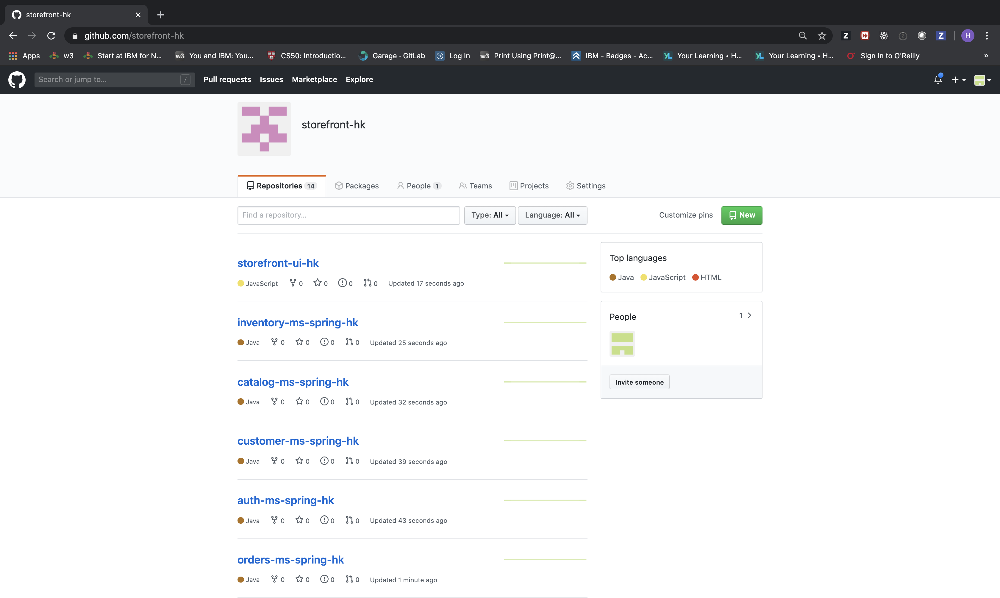

## Table of Contents
  * [Overview](#overview)
  * [Pre-requisites](#pre-requisites)
  * [Create an organization on Github](#create-an-organization-on-Github)


## Pre-requisites

Openshift 4.3, Cloud Pak for Applications, Kabanero 

## Create an organization on Github

When you create a new organization from scratch, it doesn't have any repositories associated with it.

Github has information on how to create an organization. View the link below for the steps:

https://help.github.com/en/github/setting-up-and-managing-organizations-and-teams/creating-a-new-organization-from-scratch
## Clone the storefront-repo-automator to run the script  

Go into the repository named storefront-repo-automator and clone the repository: 

https://github.com/ibm-garage-ref-storefront/storefront-repo-automator

Once you have cloned the repository, make sure you run the following command: 

``` shell
cd storefront-repo-automator
```

```shell
export org=[organization name]
export initials=[your initials]
./run.sh $org $initials
```


After running the storefront-repo-automator, you should be able to see the storefront repositories as shown above
## Create a Webhook for all microservices 


## Trigger the Webhook

