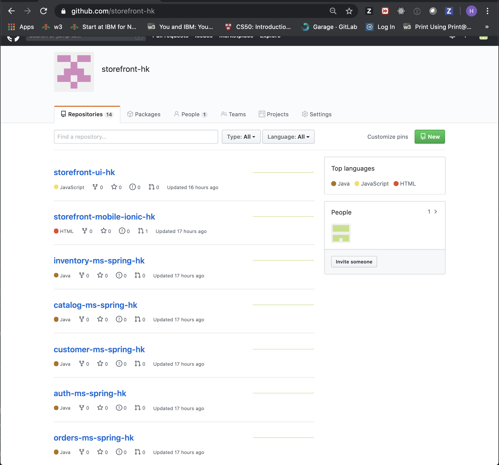
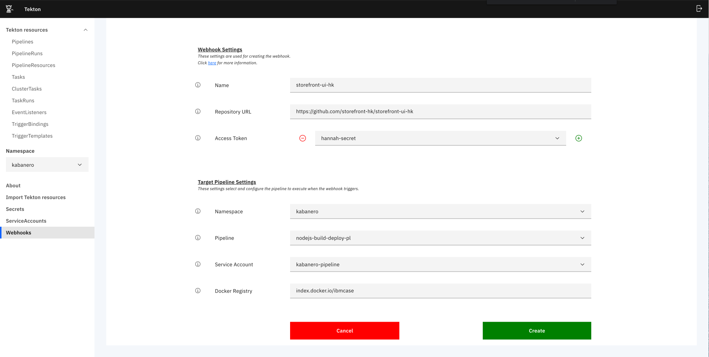

## Introduction
Today you will be learning how to deploy all storefront microservices on Openshift using Tekton

## Table of Contents
  * [Pre-requisites](#pre-requisites)
  * [Set Up databases for Storefront](#set-up-databases-for-storefront)
  * [Create an organization on Github](#create-an-organization-on-github)
  * [Create a Webhook](#create-a-webhook-for-all-microservices)
  * [Trigger the Webhook](#trigger-the-webhook)
  * [References](#references)

## Pre-requisites 

+ [`Openshift`](https://docs.openshift.com/container-platform/4.3/welcome/index.html)
+ [`Kabanero`](https://kabanero.io/)
+ [`CloudPak for Apps`](https://www.ibm.com/cloud/cloud-pak-for-applications)
+ [`Docker cli`](https://docs.docker.com/docker-for-mac/install/)
+ [`Git cli`](https://git-scm.com/downloads)
+ [`OC cli`](https://docs.openshift.com/container-platform/4.3/welcome/index.html)
+ [`Tekton cli`](https://github.com/tektoncd/cli)
+ [`gh cli`](https://cli.github.com/)
+ [appsody](https://appsody.dev/docs/getting-started/installation)


## Set Up databases for Storefront

*This project is part of the 'IBM Cloud Native Reference Architecture' suite, available at
http://cloudnativereference.dev*

This project will demonstrate how to deploy all the databases that are required by the storefront application. This will show you how to deploy MySQL, Elasticsearch, CouchDB, and MariaDB databases.

### Get the repo

Clone the repository:

```bash
git clone https://github.com/ibm-garage-ref-storefront/storefront-databases.git
cd storefront-databases
chmod +x ./setup_databases.sh
```

Run the below command to deploy the databases on the openshift cluster where `storefront-dev-{initials}` is the project name.

```bash
oc login --token={your-api-token} --server={your-servername}
./setup_databases.sh storefront-dev-{initials}
```

The output should be something similar to what is shown below.
```bash
> ./setup_databases.sh storefront-dev-oir
NAMESPACE not set. Using parameter "storefront-dev-oir"
=========================================================================
Set namespace
error: A project named "storefront-dev-oir" does not exist on "https://c100-e.us-east.containers.cloud.ibm.com:30077".
Your projects are:
* calico-system
* catapp
* csantana-cf2k8s-test1
.
.
.
* ta
* tekton-pipelines
* tigera-operator
To see projects on another server, pass '--server=<server>'.
Now using project "storefront-dev-oir" on server "https://c100-e.us-east.containers.cloud.ibm.com:30077".

You can add applications to this project with the 'new-app' command. For example, try:

    oc new-app centos/ruby-25-centos7~https://github.com/sclorg/ruby-ex.git

to build a new example application in Ruby.
=========================================================================
Adding security constraints
scc "anyuid" added to: ["system:serviceaccount:storefront-dev-oir:default"]
scc "privileged" added to: ["system:serviceaccount:storefront-dev-oir:default"]
=========================================================================
Generating necessary secrets
secret/customer-couchdb-couchdb created
secret/orders-mariadb-secret created
secret/inventory-mysql created
=========================================================================
Generating necessary configmaps
configmap/customer-couchdb-couchdb created
configmap/mariadb-configmap created
configmap/orders-mariadb-tests created
configmap/inventory-mysql-test created
=========================================================================
Deploying the databases
statefulset.apps/customer-couchdb-couchdb created
deployment.apps/elasticsearch created
statefulset.apps/orders-mariadb created
deployment.extensions/inventory-mysql created
Waiting for deployment "inventory-mysql" rollout to finish: 0 of 1 updated replicas are available...
deployment "inventory-mysql" successfully rolled out
deployment "elasticsearch" successfully rolled out
Waiting for 1 pods to be ready...
partitioned roll out complete: 1 new pods have been updated...
Waiting for 1 pods to be ready...
statefulset rolling update complete 1 pods at revision orders-mariadb-77b894447...
=========================================================================
Creating database services
service/customer-couchdb-couchdb created
service/customer-couchdb-svc-couchdb created
service/elasticsearch created
service/orders-mariadb created
service/inventory-mysql created
=========================================================================
Populating data in database
configmap/inventory-ms-spring-data created
job.batch/inventory-ms-spring-populate-mysql created
job.batch/customer-ms-spring-create-user created
job.batch/inventory-ms-spring-populate-mysql condition met
job.batch/customer-ms-spring-create-user condition met
=========================================================================
```

Now access your new project 
```
oc project {storefront-dev-initials}
```
You should get an output similar to what is shown below

```bash
> oc project {storefront-dev-initials}
> oc get pods
  NAME                                       READY     STATUS      RESTARTS   AGE
  customer-couchdb-couchdb-0                 2/2       Running     0          5m55s
  customer-ms-spring-create-user-v26cw       0/1       Completed   0          5m1s
  elasticsearch-7b49df8497-p87fd             1/1       Running     0          5m55s
  inventory-ms-spring-populate-mysql-dz8n4   0/1       Completed   0          5m2s
  inventory-mysql-8667979689-mcgkb           1/1       Running     0          5m54s
  orders-mariadb-0                           1/1       Running     0          5m55s
```
Upon completing this section you can see above all of your databases have been deployed onto your openshift cluster.

## Create an organization on Github

When you create a new organization from scratch, it doesn't have any repositories associated with it.

Github has information on how to create an organization. View the link below for the steps:

https://help.github.com/en/github/setting-up-and-managing-organizations-and-teams/creating-a-new-organization-from-scratch
## Clone the storefront-repo-automator to run the script  

Go into the repository named **storefront-repo-automator** and clone the repository: 

https://github.com/ibm-garage-ref-storefront/storefront-repo-automator

Once you have cloned the repository, make sure you run the following command: 

``` shell
cd storefront-repo-automator
```

```shell
export org=[organization name]
export initials=[your initials]
./run.sh $org $initials
```


After running the storefront-repo-automator, you should be able to see the storefront repositories as shown above
## Create a Webhook for all microservices
Today you will learning how to create a Webhook on Tekton. To achieve this, you must run the following steps:

Go on * **cloud.ibm.com** *

On the resource list, you should see a list of your clusters.

Once you have the cluster you want to work on, click on the Openshift web console. When you are on the Openshift web console, click on the box icon and go into Cloud Pak console. 

*See image below for reference*

 

Once you are inside the IBM Cloud Pak console, click on the second icon to access the * **Instances** * page. On the page inside the Pipeline box, click on the button * **Manage Pipelines** *


## Trigger the Webhook
To trigger your Webhook, you must run the following steps:

Edit the README.md file and commit to trigger a change




