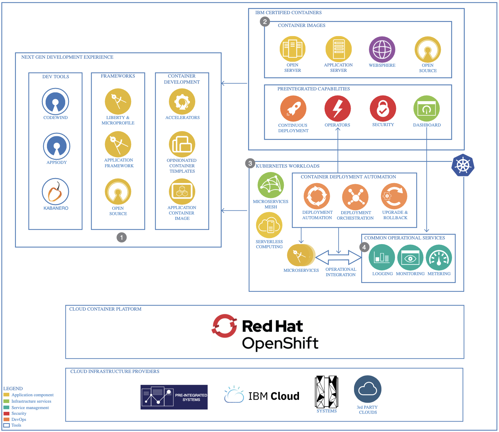

Get started with cloud-native by learning how to deploy a simple retail application, Storefront. The Storefront application implements a simple shopping application that displays a catalog of antique computing devices. People can search for and buy products from the application's web interface. You can use it as a starting point with a sample application.

As part of producing the IBM cloud-native point of view and reference architecture, we wanted to bring together a complete scenario which would cover all aspects of developing a cloud-native solution. We felt that the ecommerce business could provide a good foundation for this and would enable us to show how to develop cloud-native solutions following the architecture patterns.

## Business Case

When your team realizes the initial benefits of developing in a cloud-native framework, you discover another set of use cases that drive business growth.

- Modernize applications
- Develop new cloud-native applications
- Accelerate application delivery
- Drive business innovation

The path to cloud-native applications can vary by organization. Just creating microservices doesn't lead to the service quality and delivery frequency that is required by digital business. Likewise, just adopting tools that support agile development or IT automation doesn't lead to the increased velocity of cloud-native approaches. We need combination of practices, technologies, processes, and mind-sets that define success.

1. Developers and architects can build, run, and test solutions locally. Architects work with development teams to agree on a framework and runtimes to consolidate applications.
2. Use container images that are certified on Red Hat OpenShift by using best practices. Continuously integrate and deploy by using the provided open source tools.
3. Configure your microservices to use service mesh to make microservices leaner in complexity and have the control, observability, and security shift to the service mesh. Optimize hardware resources by using serverless computing to scale to zero.
4. The operations team manages applications by instrumenting metrics, tracing, and logs. Dashboards, GitOps, ChatOps, and event management are also used to run workloads in production.

With a focus on speed to market, cloud-native application development requires more agile, service and API-based development and continuous delivery approaches. These capabilities are supported by DevOps collaboration across development and delivery teams, modular architecture, and flexible infrastructure that can scale on demand, support multiple environments, and offer application portability.

To learn more about Cloud-native architectures, check our [architecture center](https://www.ibm.com/cloud/architecture/architectures/cloud-native/overview).
