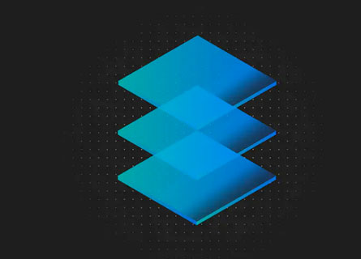

## Introduction

This project demonstrates the implementation of Orders Microservice. This microservice uses MariaDB database as its datasource. It has the complete list of all the orders placed by different customers in our store front.

Though it is a part of a bigger application, Orders service is itself an application in turn that manages the data from data store.

## Architecture

## APIs

| APIs                       | Function                          |
| -------------------------- | --------------------------------- |
| `/micro/orders`            | Get all orders                    |
| `/micro/orders/{id}`       | Get order by ID.                  |
| `/micro/orders`            | Post an order                     |

## Frameworks

<Tabs>

<Tab label="SpringBoot">

[Orders Github Repo](https://github.com/ibm-garage-ref-storefront/orders-ms-spring/)

### Project Features

  

- Leverages [Spring Boot](https://projects.spring.io/spring-boot/) framework to build a Microservices application.
- Uses [MariaDB](https://mariadb.org/) as the orders database.
- Uses [Spring Data JPA](http://projects.spring.io/spring-data-jpa/) to persist data to MariaDB database.
- [OAuth 2.0](https://oauth.net/2/) protected APIs using Spring Security framework.
- Uses [Docker](https://docs.docker.com/) to package application binary and its dependencies.
- When retrieving orders using the OAuth 2.0 protected APIs, return only orders belonging to the user identity encoded in the user_name claim in the JWT payload. For more details on how identity is propagated, refer [Auth](https://github.com/ibm-garage-ref-storefront/auth-ms-spring) Microservice.

  

<Row>
  <Column colMd={3} colLg={4} noGutterSm>
    <ImageCard
      title="Deploy the app locally"
      titleColor="light"
      aspectRatio="1:1"
      href="https://github.com/ibm-garage-ref-storefront/orders-ms-spring/blob/master/README.md"
      actionIcon="arrowRight"
      subTitleColor="light"
      subTitle="Appsody"
      >

  </ImageCard>
  </Column>
  <Column colMd={3} colLg={4} noGutterSm>
    <ImageCard
      title="Deploy the app to Openshift 4.3"
      titleColor="light"
      aspectRatio="1:1"
      href="/"
      actionIcon="arrowRight"
      subTitleColor="light"
      subTitle="Appsody"
      >

  </ImageCard>
  </Column>
  <Column colMd={3} colLg={4} noGutterSm>
    <ImageCard
      title="Deploy the app using CP4Apps"
      titleColor="light"
      aspectRatio="1:1"
      href="https://github.com/ibm-garage-ref-storefront/orders-ms-spring/blob/master/docs/CP4APPS.md"
      actionIcon="arrowRight"
      subTitleColor="light"
      subTitle="CP4Apps"
      >

  </ImageCard>
  </Column>
</Row>

</Tab>

<Tab label="OpenLiberty">

TBD

</Tab>

<Tab label="Quarkus">

TBD

</Tab>

</Tabs>
