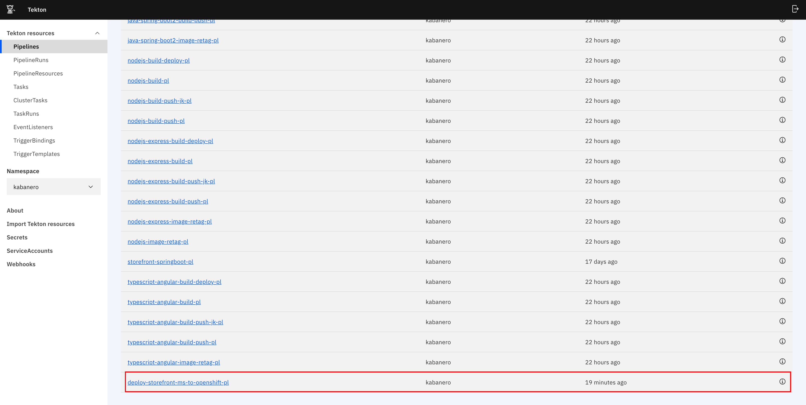
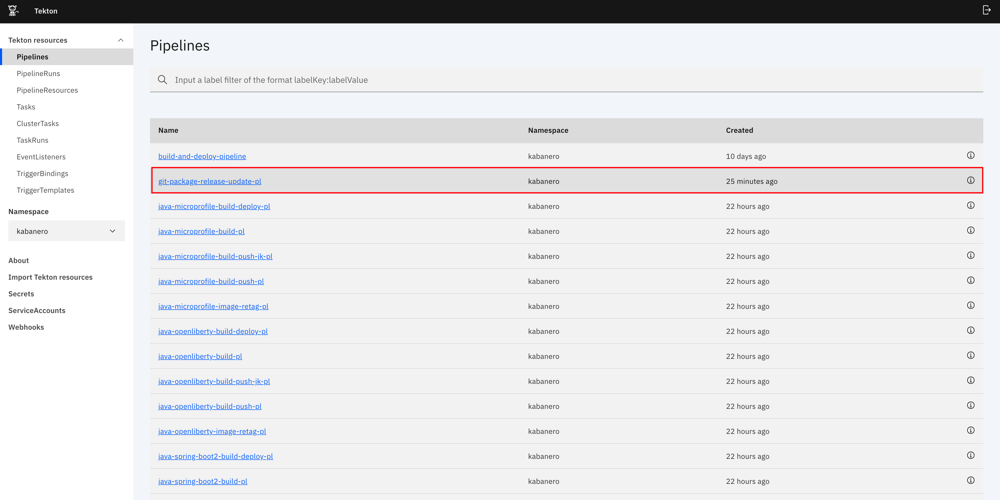

# Introduction

The sample OpenShift Pipelines that come out of the box with Cloud Pak for Applications (CP4Apps) is a good starting point to get started with DevOps.
When you need more integrations into your pipelines you will need to create your own pipelines extending the CP4Apps, 
or if you just want to have more control over the promotion of the application thru different stages like test, staging, production using GitOps.
The environment is configured with the [IBM Garage Cloud Native Toolkit](https://cloudnativetoolkit.dev/) with tools to suppor the custom pipelines.

## Table of Contents
  * [Extend, Build & Deploy Kabanero Pipelines](#extend-build--deploy-kabanero-pipelines)
  * [Overview](#overview)
  * [Pre-requisites](#pre-requisites)
  * [How to add our custom pipelines to your cluster](#how-to-add-our-custom-pipelines-to-your-cluster)
  * [How to use artifactory-package-release-update pipeline](#how-to-use-artifactory-package-release-update-pipeline)
  * [How to use git-package-release-update pipeline](#how-to-use-git-package-release-update-pipeline)
  * [Create tekton webhook](#create-a-tekton-webhook)


# Extend, Build & Deploy Kabanero Pipelines
Developers that use [Kabanero](https://kabanero.io/) pipelines often times have to extend these pipelines to do certain tasks that do not come
in the out-of-the-box Kabanero pipelines. These tasks may include code coverage, or use third party applications like
[Pact Broker](https://docs.pact.io/pact_broker), [Sonarqube](https://www.sonarqube.org/) or [Artifactory](https://jfrog.com/artifactory/)
to full-fill software requirements. Currently, there are not many methods to manage and version control your Kabanero
pipelines, and the goal of this repository is to help you get going.

- You will learn how to add our custom pipelines to your dedicated cluster. In addition, not required
you will also learn how to manage and version control your kabanero pipelines.

- You will learn how to package, host your pipelines in different environments such as Git or Artifactory and use
these pipelines to automate the process of updating the [Kabanero custom resource](https://kabanero.io/docs/ref/general/configuration/kabanero-cr-config.html)
to a respective host where your Kabanero pipelines exist.


# Overview
We built our pipelines on top of out of box kabanero java-spring-boot2-build-deploy-pl for Spring boot and nodejs-express-build-deploy-pl for nodejs pipeline. Below are the additional tasks we have in our pipelines at the moment.

- Testing: This task runs all the unit tests required for the application.
- Sonar Scan: This task performs sonar scan which helps to detect the code smells, vulnerabilities, bugs etc in your application code.
- Pact Contract Testing: This task performs contract testing. It shares consumer driven contracts and verifies the results using Pact.
- Health checks: This task checks the rollout status of your deployment once it is deployed to the cluster and verifies the application health.
- GitOps: This task will update the the deployment manifests residing in gitops-dev repository.


### Useful Links
- [Github Repo for pipelines](https://github.com/ibm-garage-ref-storefront/devops-pipelines)
- [Github Repo for pipelines server](https://github.com/ibm-garage-ref-storefront/pipelines-server/)

This repository includes a set of custom
[pipelines](https://github.com/ibm-garage-ref-storefront/devops-pipelines/tree/master/pipelines)

| Stable  | Description  |
|---|---|
| [artifactory-package-release-update](https://github.com/ibm-garage-ref-storefront/devops-pipelines/tree/master/pipelines/stable/artifactory-package-release-update)  |  Compress custom pipelines, upload compressed pipelines to artifactory, and updates the Kabanero Custom Resource |
| [clone-storefront-ms-push-repos-to-org](https://github.com/ibm-garage-ref-storefront/devops-pipelines/tree/master/pipelines/stable/clone-storefront-ms-push-repos-to-org) | Given a github org name, clone storefront microservices and deploy them to the github org   |
| [git-package-release-update](https://github.com/ibm-garage-ref-storefront/devops-pipelines/tree/master/pipelines/stable/git-package-release-update) | Compress custom pipelines, create a github release, upload compressed pipelines to the release, and update the Kabanero Custom Resource |
| [storefront-nodejs](https://github.com/ibm-garage-ref-storefront/devops-pipelines/tree/master/pipelines/stable/storefront-nodejs) |  This custom pipeline is built on top of nodejs-build-deploy-pl (out of box kabanero pipeline for nodejs applications). It contains additional tasks such as test, sonar-scan, pact-broker, health checks, and gitops tasks |
| [storefront-springboot](https://github.com/ibm-garage-ref-storefront/devops-pipelines/tree/master/pipelines/stable/storefront-springboot) |  This custom pipeline is built on top of java-spring-boot2-build-deploy-pl (out of box kabanero pipeline for java spring boot applications). It contains additional tasks such as test, sonar-scan, pact-broker, health checks, and gitops tasks |


# Pre-requisites
Install the following CLI's on your laptop/workstation:

  + [`docker cli`](https://docs.docker.com/docker-for-mac/install/)
  + [`git cli`](https://git-scm.com/downloads)
  + [`oc cli`](https://docs.openshift.com/container-platform/4.3/welcome/index.html)
  + [`Openshift 4.3.5 with CloudPak for Apps`](https://www.ibm.com/cloud/cloud-pak-for-applications)
  + [`tekton cli`](https://github.com/tektoncd/cli)
  + [`Kabanero 0.6.1`](https://github.com/kabanero-io)
  + [Tools Kit created by the Catalyst Team](https://cloudnativetoolkit.dev/admin/overview)


# How to add our custom pipelines to your cluster
You can add the custom pipelines to your cluster we created by following the steps below.

### Steps
1. Login to your cluster and change to the kabanero namespace

    ```bash
    oc login --token=your-token --server=your-server
    oc project kabanero
    ```
2. Download our latest release by visiting https://github.com/ibm-garage-ref-storefront/pipelines-server/releases

   Click on `default-kabanero-pipelines.tar.gz` file to download the zip file onto your Downloads.

   Then run the following command to obtain the checksum value. You will use this checksum value later.
   ```bash
   > shasum -a 256 default-kabanero-pipelines.tar.gz
     4c05cb2d593af43a3e4c6818ada1afc4e550e3c6bc08bbbf486eb2ab6ce37274  default-kabanero-pipelines.tar.gz
   ```

3. Edit your Kabanero Custom Resource and add our pipelines

    ```bash
    > oc edit kabanero -o yaml
    ```
4. Add the following:

   ```yaml
   stacks:
     pipelines:
     - https:
         url: the-url-to-download-the-zip-file
       id: pipeline-manager
       sha256: the-checksum-value-you-generated
   ```
   For example we currently are on release v38.0 and our Kabanero custom resource looks like the following:

   ```yaml
    stacks:
      pipelines:
      - https:
          url: https://github.com/kabanero-io/kabanero-pipelines/releases/download/0.6.1/default-kabanero-pipelines.tar.gz
        id: default
        sha256: 64aee2805d36127c2f1e0e5f0fc6fdae5cef19360c1bb506137584f3bd0988cc
      - https:
          url: https://github.com/ibm-garage-ref-storefront/pipelines-server/releases/download/39.0/default-kabanero-pipelines.tar.gz
        id: pipeline-manager
        sha256: 4c05cb2d593af43a3e4c6818ada1afc4e550e3c6bc08bbbf486eb2ab6ce37274
   ```
5. Save your changes
   ```
    esc
    :wq
   ```
   You might get an error such as `Unable to save custom resource...` you just need to update the `resourceVersion` key with the latest time stamp.

### Result
1. Verify the custom pipelines have been added to your cluster as shown below:

    ```bash
    > tkn pipelines list
        .
        .
        .
        artifactory-package-release-update-pl      1 week ago    ---                                       ---           ---          ---
        git-package-release-update-pl              1 week ago    git-package-release-update-pl-run-8fpcq   ---           ---          ---
        clone-storefront-ms-push-repos-to-org-pl   1 week ago    ---                                       ---           ---          ---
        storefront-nodejs-pl                       1 week ago    storefront-nodejs-pl-run-7gjbm            ---           ---          ---
        storefront-springboot-pl                   1 week ago    storefront-springboot-pl-run-glsxs        ---           ---          ---
        .
        .
        .
    ```
    *You are now ready to use our custom pipelines.*

# How to use artifactory-package-release-update pipeline
You can use this pipeline to package, release your pipelines onto Artifactory. This pipeline is for developers that are extending Kabanero pipelines
to create custom tasks or pipelines and need a solution to version control your pipelines.

### Pre-reqs
- Fork the [devops-pipelines](https://github.com/ibm-garage-ref-storefront/devops-pipelines) repository
- Deploy [Artifactory](https://github.com/ibm-cloud-architecture/gse-devops/tree/master/cloudpak-for-integration-tekton-pipelines#artifactory) on your Openshift cluster

- Generate an [API Key](https://www.jfrog.com/confluence/display/JFROG/User+Profile).
- Update Artifactory config map
[artifactory-config.yaml](./pipelines/stable/artifactory-package-release-update/configmaps/artifactory-config.yaml) and update the `artifactory_key`. Once done, run the following
commands:

      oc project kabanero
      cd ./configmaps
      oc apply -f artifactory-config.yaml
### Steps
1. Go to the [pipelines](./pipelines) directory make any modifications you want to do to any of the pipelines, or include your own.

2. Create your pipeline by running the following command:

        cd pipelines/experimental
        oc apply --recursive --filename pipelines/experminetal/artifactory-package-release-update/
3. Go to the dashboard and verify that the `artifactory-package-release-update-pl` has been added to the Tekton dashboard

4. Go to section [Create tekton webhook](#create-a-tekton-webhook) to create your web hook.

5. Go to your forked repository and make a change, and your Tekton dashboard should create a
new pipeline run as shown below:

Where the `git-source` is defined as the pipeline resource with key [url] and value [github repo url]

### Result
The end result should look like the following:


# How to use git-package-release-update pipeline
You can use a pipeline to automate the process of extending, packaging and releasing your pipelines via a Git Release. The process is very similar to the section above.

### Pre-reqs
- Fork this repository [devops-pipelines](https://github.com/ibm-garage-ref-storefront/devops-pipelines)

### Steps
1. Add your custom pipelines or modify an existing one
   If you inspect `./pipelines/` you can create a new folder for each new pipeline you have and follow a similar structure as below.

      ```bash
      echo pwd
      ./devops-pipelines/pipelines
      ├── experimental
      │   ├── README.md
      │   ├── abc
      │   │   ├── bindings
      │   │   │   ├── abc-pl-pullrequest-binding.yaml
      │   │   │   └── abc-pl-push-binding.yaml
      │   │   ├── configmaps
      │   │   │   └── abc-pl-configmap.yaml
      │   │   ├── pipelines
      │   │   │   └── abc-pl.yaml
      │   │   ├── secrets
      │   │   │   └── abc-pl-secret.yaml
      │   │   ├── tasks
      │   │   │   └── abc-task.yaml
      │   │   └── template
      │   │       └── abc-pl-template.yaml
      │   └── manifest.yaml
      ├── stable
      │   ├── README.md
      │   ├── cde
      │   │   ├── bindings
      │   │   │   ├── cde-pl-pullrequest-binding.yaml
      │   │   │   └── cde-pl-push-binding.yaml
      │   │   ├── configmaps
      │   │   │   └── cde-pl-configmap.yaml
      │   │   ├── pipelines
      │   │   │   └── cde-pl.yaml
      │   │   ├── secrets
      │   │   │   └── cde-pl-secret.yaml
      │   │   ├── tasks
      │   │   │   └── cde-task.yaml
      │   │   └── template
      │   │       └── cde-pl-template.yaml
      │   └── manifest.yaml
    ```

<InlineNotification>
Note: Pipelines in `experimental` do not get built.
</InlineNotification>

2. Now drag and drop your pipelines and tasks to any of these folders,

3. You must update the `configmap` and `secret` we provided for you. But first, create another repository such as `devops-server`. In this repo `devops-server` you will be hosting your pipelines as Git releases. Do not forget to create a README.md file.

    Navigate to `pipelines/stable/git-package-release-update/configmaps` and update the `pipeline-server-configmap.yaml`

    ```yaml
    apiVersion: v1
    kind: ConfigMap
    metadata:
    name: pipeline-server-configmap
    namespace: kabanero
    data:
        repo_org: your-github-username-or-org
        repo_name: your-github-repo-where-you-will-host-pipelines
        image_registry_publish: 'false'
        kabanero_pipeline_id: pipeline-manager
    ```

    Update the secret in `pipelines/stable/git-package-release-update/secrets/`

    ```yaml
    apiVersion: v1
    kind: Secret
    metadata:
        name: pipeline-server-git
        namespace: kabanero
        type: kubernetes.io/basic-auth
    data:
        password: your-git-token-encoded
        username: your-git-username-encoded
    ```

    Now run the following command to be able to retrieve resources for the `kabanero-pipeline` service account.

    ```bash
    oc adm policy add-cluster-role-to-user view system:serviceaccount:kabanero:kabanero-pipeline
    ```

4. Create web hook for the [devops-pipelines](https://github.com/ibm-garage-ref-storefront/devops-pipelines) repository you created on step 1.

5. Deploy your pipeline, tasks, event bindings and trigger templates by running the following command in the [devops-pipelines](https://github.com/ibm-garage-ref-storefront/devops-pipelines) repo you created on step 1:

    ```bash
    oc apply --recursive --filename pipelines/stable/git-package-release-update
    git add .
    git commit -m "adding new pipelines..."
    git push
    ```
### Result

- Your output should be the following:


- If you go to the [pipelines-server](https://github.com/ibm-garage-ref-storefront/pipelines-server/) repo you created on step 2, you should see a new release with your zip files as shown below:

- Now inspect your Kabanero Custom Resource to ensure your `default-kabanero-pipelines.tar.gz` got added to the `pipelines` key value pair.

  ```bash
  oc get kabanero -o yaml
  ```

  ```yaml
  stacks:
      pipelines:
      - https:
          url: https://github.com/ibm-garage-ref-storefront/pipelines-server/releases/download/1.0/default-kabanero-pipelines.tar.gz
      id: pipeline-manager
      sha256: 8fe10018016e5059640b1a790afe2d6a1ff6c4f54bf3e7e4fa3fc0f82bb2207d
  ```

- The pipelines that you added to the [pipelines-server](https://github.com/ibm-garage-ref-storefront/pipelines-server/) repository should now be visible on the tekton dashboard as shown below:



Now you can reuse these pipelines across your organization! If your cluster comes down you now have a backup of your pipelines.

# Create a tekton webhook
### Pre-reqs

You need to create an access token on the tekton dashboard or cli in the kabanero namespace.
Earlier you created a github token on the github dashboard. You will need to get that token or generate another one and
paste it below.


- Web hook Settings:
    ```
    Name: devops-demo-kabanero-pipelines
    Repistory-url: your forked repo url goes here
    Access Token: Token you generated previously
    ```

- Target Pipeline Settings
    ```
    Namespace: kabanero
    Pipeline: Choose artifactory-package-release-update-pl or git-package-release-update-pl
    Service Account: Pipeline
    Docker Registry: us.icr.io/project-name or docker.hub.io/projectname
    ```
